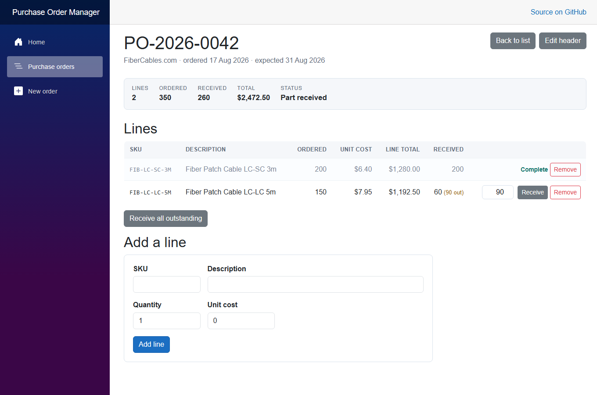
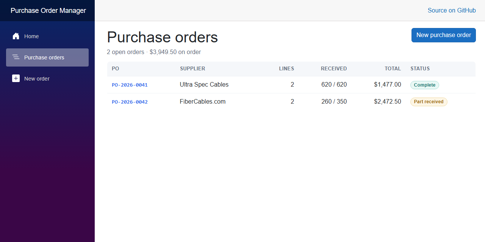

# Purchase Order Manager

Supplier purchase orders with line items and partial receipts. Raise a PO, add the
lines you are buying, then receive stock against those lines as it arrives — including
when only part of a line turns up. Built to demonstrate master-detail relationships and
derived aggregates on SQL Server.



## The problem it solves

Purchasing spreadsheets go wrong in a specific way: someone edits a line and forgets to
update the total, so the order disagrees with its own contents and nobody notices until
the invoice does not match. This app makes that impossible:

- **There is no `Total` column.** The total is `SUM(QuantityOrdered × UnitCost)` over
  the lines, so it cannot drift from them
- Receipt status is derived the same way, by comparing received against ordered
- **Received can never exceed ordered** — clamped on the server, not by the input box
- Deleting an order takes its lines with it; a supplier still in use cannot be deleted

## Features

Implemented today:

- Purchase orders and their lines in a real master-detail relationship
- Order totals, quantities and receipt status derived from the lines, never stored
- Partial receipts, with outstanding quantity tracked per line and accumulating across
  deliveries
- Over-receiving clamped server-side, and the user told what was actually received
- Duplicate PO numbers rejected by a unique index
- Cancel an order (soft delete); remove a line (hard delete)
- Responsive — dense tables become stacked cards on a phone

Not implemented: receipt history, cost variance, filtering, authentication, and a
screen for cancelled orders. See [Project status](#project-status).



## Technology stack

| Layer | Choice |
|---|---|
| Framework | .NET 10, Blazor Server (Interactive Server rendering) |
| UI | MudBlazor 9.9.0 |
| Data access | Entity Framework Core 10 |
| Database | SQL Server — LocalDB in development |

**There is no HTTP API in this project, and no Swagger/OpenAPI.** It is a
server-rendered Blazor application: the Razor components query EF Core directly
through an injected `IDbContextFactory<PurchasingDbContext>`.

## Solution structure

| Project | Holds |
|---|---|
| `PurchaseOrders.Web` | Blazor Server app — list, detail, header form, layout, startup |
| `PurchaseOrders.Data` | `PurchasingDbContext`, the three models **and the business rules**, EF Core migrations |

The project reference points **one way only**: Web references Data, never the reverse.

Unusually for these portfolio apps, the interesting logic is **not** in the components.
Totals, outstanding quantities and receipt status are derived properties on the domain
model, so every screen reads the same numbers and none of them computes its own.

## Requirements

- Visual Studio 2026 with the ASP.NET and web development workload
- .NET 10 SDK
- SQL Server LocalDB (installed with that workload) — or any SQL Server instance

## Getting it running

1. Open `PurchaseOrderManager.sln` in Visual Studio 2026.
2. Right-click **`PurchaseOrders.Web`** → **Manage User Secrets**, and add a connection
   string named `PurchasingDatabase` pointing at your LocalDB instance
   (`(localdb)\MSSQLLocalDB`) with the database named `PurchaseOrderManager`.
   `appsettings.json` keeps the key with a blank value so the shape is documented
   without a credential in the repository.
3. Apply the migration. In **Package Manager Console** set **Default project** to
   `PurchaseOrders.Data` **and** make sure the **startup project is
   `PurchaseOrders.Web`** — the EF Core tools and the connection string both live
   there — then run:

   ```powershell
   Update-Database
   ```

4. Press F5 and open `/purchase-orders`.

The database is **not** created automatically at startup; step 3 is required on a
fresh clone. Four suppliers are seeded by the migration so the dropdown is never empty.

Full setup detail, including the CLI equivalent and eight checks that prove the
master-detail behavior works, is in
[docs/getting-started.md](docs/getting-started.md).

## Documentation

| Document | Covers |
|---|---|
| [docs/getting-started.md](docs/getting-started.md) | Setup from a fresh clone, eight verification checks, current deployment state |
| [docs/architecture.md](docs/architecture.md) | Projects, layers, where the business rules live, page flow |
| [docs/database.md](docs/database.md) | Schema, master-detail, why there is no Total column, ER diagram |
| [docs/configuration.md](docs/configuration.md) | Every setting, User Secrets, environments |
| [docs/troubleshooting.md](docs/troubleshooting.md) | Totals, receipts, EF Core and UI problems specific to this app |

## Project status

Working and complete for what it sets out to prove: three related tables, a real
master-detail relationship with two different delete rules, aggregates derived rather
than stored, and a business rule enforced on the server. It is a portfolio project
rather than a product, and is not deployed to a public URL — it runs locally against
LocalDB.

What I would add next:

- Receipt history, so each delivery is its own record rather than a running total
- Cost variance between the ordered unit cost and what was actually invoiced
- Filter by supplier and by receipt status
- Unit tests over the derived totals and the clamping logic in the receive path

## License

MIT — see [LICENSE](LICENSE).

---

Self-directed portfolio project.
