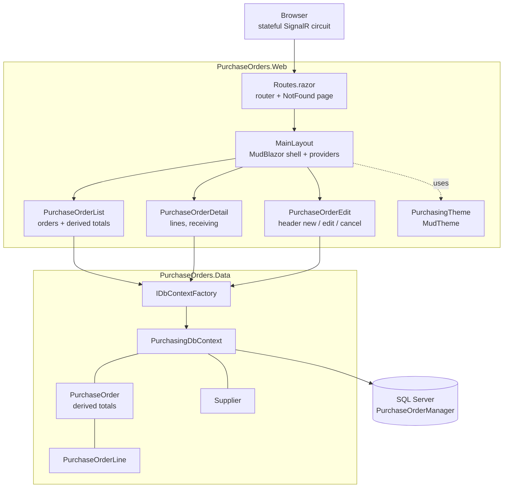

# Architecture

How Purchase Order Manager is put together, and why it is arranged this way.

This describes the code as it exists today. Ideas that are not built are collected
under [Recommendations](#recommendations).

## Shape of the solution

| Project | Type | Responsibility |
|---|---|---|
| `PurchaseOrders.Web` | `Microsoft.NET.Sdk.Web` | Screens, layout, theme, startup and configuration |
| `PurchaseOrders.Data` | `Microsoft.NET.Sdk` class library | `PurchaseOrder`, `PurchaseOrderLine`, `Supplier`, `PurchasingDbContext`, migrations |

`PurchaseOrders.Web` references `PurchaseOrders.Data`. **`PurchaseOrders.Data`
references nothing from the web project** — that rule keeps the data layer, including
the derived-total logic, testable without Blazor.

## How a request flows



There is **no HTTP API layer** — no controllers, no minimal-API endpoints, no
Swagger/OpenAPI.

## The domain model carries the business rules

This is what distinguishes this app from the others in the portfolio. The interesting
logic is **not** in the components — it is on the entities in the data project.

```csharp
public decimal Total => Lines.Sum(l => l.LineTotal);
public ReceiptState Receipt =>
    Lines.Count == 0 ? ReceiptState.Empty
    : TotalReceived == 0 ? ReceiptState.Awaiting
    : TotalReceived < TotalOrdered ? ReceiptState.Partial
    : ReceiptState.Complete;
```

Three consequences:

- **Every screen agrees automatically.** The list and the detail page both read
  `order.Total` and `order.Receipt`; neither computes its own version, so they cannot
  disagree.
- **The rules are testable without a browser or a database** — construct a
  `PurchaseOrder`, add lines, assert the state. There is no test project yet, but the
  shape allows one.
- **They must be `Ignore`d in `OnModelCreating`**, or EF Core looks for columns behind
  them. See [database.md](database.md#the-design-decision-that-shapes-everything-no-stored-total).

`ReceiptState` is an `enum`, not a string — the four states are a closed set, and the
component maps them to labels and colors rather than storing display text.

## Rendering model

Blazor Server, **Interactive Server** rendering applied globally in `App.razor`.
Components run on the server; the browser holds a SignalR connection.

The receive form relies on this directly: `PurchaseOrderDetail` keeps a
`Dictionary<int, int> receiveQty` of what has been typed per line, held in server
memory across events, and falls back to each line's `Outstanding` for any line not
typed into.

## Startup and pipeline

All configuration is in `Program.cs`.

| Registration | Purpose |
|---|---|
| `AddRazorComponents().AddInteractiveServerComponents()` | Blazor Server |
| `AddMudServices()` | MudBlazor |
| `AddDbContextFactory<PurchasingDbContext>(...UseSqlServer(...))` | Data access |

Pipeline: `UseExceptionHandler("/Error")` and `UseHsts()` (non-development only),
`UseStatusCodePagesWithReExecute("/not-found")`, `UseHttpsRedirection()`,
`UseAntiforgery()`, `MapStaticAssets()`, then
`MapRazorComponents<App>().AddInteractiveServerRenderMode()`.

No `Migrate()` or `EnsureCreated()` — the app never touches its own schema.

## Data access

`IDbContextFactory<PurchasingDbContext>` injected into components; each operation
opens its own short-lived context. There is no repository or service layer — for an
app this size `DbSet<T>` and `IQueryable<T>` already are the repository.

**The one rule that must be followed:** any query whose result will be asked for a
total has to `.Include(o => o.Lines)`. The derived properties read an in-memory
collection, so an order loaded without lines reports zero rather than failing loudly.

## Pages and routing

| Route | Component | Does |
|---|---|---|
| `/` | `Home.razor` | Landing page |
| `/purchase-orders` | `PurchaseOrderList.razor` | Orders with supplier, derived total and receipt status |
| `/purchase-orders/{Id:int}` | `PurchaseOrderDetail.razor` | Lines, add a line, receive stock, remove a line |
| `/purchase-orders/new` | `PurchaseOrderEdit.razor` | Create the header |
| `/purchase-orders/edit/{Id:int}` | `PurchaseOrderEdit.razor` | Edit the header, cancel the order |
| `/not-found` | `NotFound.razor` | Re-executed target for non-200 status codes |
| `/Error` | `Error.razor` | Unhandled exception page, non-development only |

**The header and the lines are edited on different screens**, which is the natural
shape for master-detail: the header is a form you submit, the lines are a working
surface you return to as stock arrives.

After creating a new order, `PurchaseOrderEdit` navigates to the **detail** page
rather than the list — a new order has no lines yet, so the list would show it looking
empty and the next action would be a click away.

## UI layer

MudBlazor 9.9.0. `MainLayout.razor` hosts the four required providers.

`PurchasingTheme.cs` holds the `MudTheme`: slate navy with a dark app bar over a mini
drawer, IBM Plex Sans, 4px radius, dense striped tables, 0.85rem base — the densest of
the portfolio apps, because this one shows the most numbers per screen.

`wwwroot/app.css` is **almost empty by design**. Everything is MudBlazor or scoped
component CSS.

## Validation

Two layers, both server-side:

1. **Data annotations** on all three models drive the forms through
   `<DataAnnotationsValidator />`.
2. **The database** enforces the unique PO number and both foreign keys.

Plus a third that is neither: **the receive clamp**. `Math.Min(wanted,
line.Outstanding)` is a business rule, not a field constraint — it cannot be expressed
as an attribute because it depends on the line's current state. It lives in
`ReceiveAsync` and runs on the server, so bypassing the input's `max` in the browser
achieves nothing.

## Error handling

| Situation | Handling |
|---|---|
| Unhandled exception | `UseExceptionHandler("/Error")` — production only |
| Unknown URL | `UseStatusCodePagesWithReExecute("/not-found")` |
| Unknown order id | `PurchaseOrderDetail` and `PurchaseOrderEdit` redirect to `/purchase-orders` |
| Duplicate PO number | `DbUpdateException` whose inner `SqlException` is 2601/2627; message shown, typed values kept |
| Any other save failure on the header | Generic message on screen, real exception written to the log |
| Over-receiving | Clamped, and the user is told what was actually received |
| Receiving zero or less | Rejected with a message before any save |

**The line paths are the gap** — `AddLineAsync` and `RemoveLineAsync` have no handler
at all. Listed under [Recommendations](#recommendations).

## Authentication and external services

**Neither exists.** No authentication, no external API calls, no email, no file
storage. Every page is public.

## Patterns actually in use

- **Master-detail** with cascade on the detail and restrict on the lookup
- **Derived properties on the domain model** rather than stored aggregates
- **A closed `enum`** for receipt state, mapped to display at the edge
- **Factory-per-operation** for `DbContext`
- **Soft delete** on orders, hard delete on lines — deliberately different
- **Server-side clamping** of a business rule the UI cannot be trusted to enforce
- **`AsNoTracking` on read paths**

## Recommendations

**None of the following is implemented.**

| Recommendation | Why |
|---|---|
| Handle `DbUpdateException` on the add-line and remove-line paths | They currently have no handler; a database failure there is an unhandled exception |
| Add a test project | The derived totals and the receive clamp are pure logic with no dependencies — the easiest, highest-value tests in the portfolio |
| Record receipts as rows rather than a running total | `QuantityReceived` loses the history of individual deliveries |
| Add a concurrency token | Two people receiving the same line at once lose one delivery |
| Aggregate in SQL for large orders | Totals are computed after loading every line |

### Cleanup done while documenting

Three leftovers from before the MudBlazor restyle, all **fixed**:

1. **`wwwroot/lib/bootstrap/` was dead weight** — 16 CSS files nothing referenced.
   Deleted.
2. **`Error.razor` styled its headings with `text-danger`**, a Bootstrap class, with
   Bootstrap unlinked — so it resolved to nothing. `Error.razor` and `NotFound.razor`
   are now MudBlazor pages.
3. **`app.css` was 193 lines of stock template CSS** plus a hand-written table, form
   and receipt-status layout from the pre-MudBlazor UI. Every rule was verified unused
   before removal. Reduced to a comment.

**Note this differs from `order-status-board`**, where `app.css` is live code holding
the board grid. Check before assuming either way.
