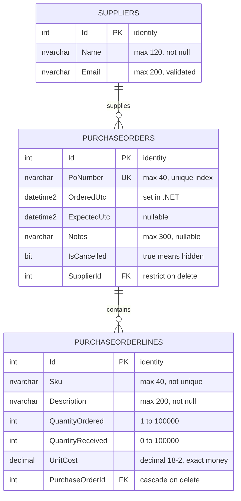

# Database

How Purchase Order Manager stores its data: the schema, the EF Core configuration
behind it, and the behavior that follows from both.

Everything here describes the code as it exists. Anything not yet built is kept in
[Not implemented](#not-implemented) at the end.

## At a glance

| | |
|---|---|
| Engine | SQL Server (LocalDB in development) |
| ORM | Entity Framework Core 10.0.11, SQL Server provider |
| Context | `PurchasingDbContext` in `PurchaseOrders.Data` |
| Tables | `Suppliers`, `PurchaseOrders`, `PurchaseOrderLines` |
| Migrations | One — `20260826141247_InitialCreate` |
| Seed data | Four suppliers, inserted by the migration |
| Auto-created at startup | **No** — the migration must be applied manually |

## Connection

The connection string is named **`PurchasingDatabase`** and the database is named
**`PurchaseOrderManager`**. It is read in `Program.cs` and registered with
`AddDbContextFactory`, not `AddDbContext`, because Blazor Server components are
long-lived and several can run at once.

The real value lives in **User Secrets only**; `appsettings.json` carries the key with
an empty string. See [configuration.md](configuration.md).

## The design decision that shapes everything: no stored total

**`PurchaseOrders` has no `Total` column.** It is not an oversight, and it should not
be "fixed" by adding one.

The total is computed in C# from the lines:

```csharp
public decimal Total => Lines.Sum(l => l.LineTotal);
public int TotalOrdered => Lines.Sum(l => l.QuantityOrdered);
public int TotalReceived => Lines.Sum(l => l.QuantityReceived);
```

A stored total is a second copy of something the line items already state. The moment
a line is added, edited or removed without recalculating it, the order disagrees with
itself — and no constraint in the database can catch that. Deriving the number means it
cannot drift.

The same applies per line:

```csharp
public decimal LineTotal => QuantityOrdered * UnitCost;
public int Outstanding => QuantityOrdered - QuantityReceived;
public bool IsFullyReceived => QuantityReceived >= QuantityOrdered;
```

**These derived members must be hidden from EF Core**, or it will look for columns
behind them and the migration will fail. That is what these lines in `OnModelCreating`
are for:

```csharp
modelBuilder.Entity<PurchaseOrder>().Ignore(p => p.Total);
modelBuilder.Entity<PurchaseOrder>().Ignore(p => p.TotalOrdered);
modelBuilder.Entity<PurchaseOrder>().Ignore(p => p.TotalReceived);
modelBuilder.Entity<PurchaseOrder>().Ignore(p => p.Receipt);

modelBuilder.Entity<PurchaseOrderLine>().Ignore(l => l.LineTotal);
modelBuilder.Entity<PurchaseOrderLine>().Ignore(l => l.Outstanding);
modelBuilder.Entity<PurchaseOrderLine>().Ignore(l => l.IsFullyReceived);
```

**Add a derived property and you must add an `Ignore` for it.** Forgetting produces a
confusing migration that tries to create a column for a read-only expression.

### The cost of deriving

Because `Total` is computed from `Lines`, **an order loaded without its lines reports a
total of zero** rather than throwing. Any query that needs a total must
`.Include(o => o.Lines)`. Both screens that show totals do.

## Entities

### PurchaseOrder — the master

| Property | CLR type | Column | Rules |
|---|---|---|---|
| `Id` | `int` | `int`, identity, PK | |
| `PoNumber` | `string` | `nvarchar(40)`, not null | **Unique index.** Required |
| `OrderedUtc` | `DateTime` | `datetime2`, not null | Set in .NET |
| `ExpectedUtc` | `DateTime?` | `datetime2`, **null** | Optional delivery date |
| `Notes` | `string?` | `nvarchar(300)`, null | Optional |
| `IsCancelled` | `bool` | `bit`, not null | Soft delete |
| `SupplierId` | `int` | `int`, not null, FK | Must be 1 or greater |
| `Lines` | `List<PurchaseOrderLine>` | — | The detail rows |
| `Total`, `TotalOrdered`, `TotalReceived`, `Receipt` | — | **no column** | Derived, `Ignore`d |

### PurchaseOrderLine — the detail

| Property | CLR type | Column | Rules |
|---|---|---|---|
| `Id` | `int` | `int`, identity, PK | |
| `Sku` | `string` | `nvarchar(40)`, not null | Required. **Not unique** — the same SKU can appear on many orders |
| `Description` | `string` | `nvarchar(200)`, not null | Required |
| `QuantityOrdered` | `int` | `int`, not null | Range 1–100,000 |
| `QuantityReceived` | `int` | `int`, not null | Range 0–100,000 |
| `UnitCost` | `decimal` | `decimal(18,2)`, not null | Range 0–999,999 |
| `PurchaseOrderId` | `int` | `int`, not null, FK | **Cascade delete** |
| `LineTotal`, `Outstanding`, `IsFullyReceived` | — | **no column** | Derived, `Ignore`d |

### Supplier

| Property | CLR type | Column | Rules |
|---|---|---|---|
| `Id` | `int` | `int`, identity, PK | |
| `Name` | `string` | `nvarchar(120)`, not null | Required |
| `Email` | `string` | `nvarchar(200)`, not null | Required, `[EmailAddress]` |

## Schema



No `Total` anywhere — that is the point.

## Relationships and delete behavior

**The two foreign keys use deliberately different rules**, and the difference is the
most interesting thing in the schema.

```csharp
// Lines cascade with their order.
modelBuilder.Entity<PurchaseOrderLine>()
    .HasOne(l => l.PurchaseOrder)
    .WithMany(p => p.Lines)
    .HasForeignKey(l => l.PurchaseOrderId)
    .OnDelete(DeleteBehavior.Cascade);

// Suppliers are protected.
modelBuilder.Entity<PurchaseOrder>()
    .HasOne(p => p.Supplier)
    .WithMany(s => s.PurchaseOrders)
    .HasForeignKey(p => p.SupplierId)
    .OnDelete(DeleteBehavior.Restrict);
```

| Relationship | Rule | Why |
|---|---|---|
| Order → Lines | **Cascade** | A line has no meaning without its order. Orphaning it would be worse than deleting it |
| Supplier → Orders | **Restrict** | A supplier is referenced by orders that still matter. The database refuses rather than silently breaking them |

**Cascade is correct here and only here.** It is the one relationship in these
portfolio apps where the child genuinely cannot exist alone.

## Indexes

| Index | Table | Columns | Unique |
|---|---|---|---|
| `IX_PurchaseOrders_PoNumber` | `PurchaseOrders` | `PoNumber` | **yes** |
| `IX_PurchaseOrders_SupplierId` | `PurchaseOrders` | `SupplierId` | no |
| `IX_PurchaseOrderLines_PurchaseOrderId` | `PurchaseOrderLines` | `PurchaseOrderId` | no |

`IX_PurchaseOrderLines_PurchaseOrderId` matters more here than a foreign-key index
usually does: every detail page loads lines by parent id, so it is on the hot path.

### The soft-delete consequence, again

`IX_PurchaseOrders_PoNumber` has no filter, so it covers cancelled orders too. A
cancelled order keeps its PO number reserved, and reusing that number is rejected as a
duplicate even though the order is hidden. Same trade-off as the other apps in this
portfolio; the fix, if ever wanted, is a filtered unique index and a new migration.

## Migrations

One migration: **`20260826141247_InitialCreate`**, in `PurchaseOrders.Data/Migrations`.

Migrations live in `PurchaseOrders.Data`; the EF Core tools and the connection string
live in `PurchaseOrders.Web`. Both must be named:

```bash
dotnet ef database update --project PurchaseOrders.Data --startup-project PurchaseOrders.Web
dotnet ef migrations add <Name> --project PurchaseOrders.Data --startup-project PurchaseOrders.Web
```

In Package Manager Console: **Default project** `PurchaseOrders.Data`, **startup
project** `PurchaseOrders.Web`.

## Seed data

Four suppliers, so the dropdown is never empty on first run:

| Id | Name |
|---|---|
| 1 | Ultra Spec Cables |
| 2 | FiberCables.com |
| 3 | Wallplate City |
| 4 | Nerdom Micro |

**No purchase orders or lines are seeded.** A fresh database has suppliers and nothing
else, which is correct — orders are the thing the user creates.

## Database initialization

No `EnsureCreated()` and no `Migrate()` in `Program.cs`. The app never creates or
upgrades its own database, so a fresh clone needs `Update-Database` run by hand.

## How the application reads and writes

No repository or service layer — components inject
`IDbContextFactory<PurchasingDbContext>` and query EF Core directly.

**Loading a purchase order** must include the lines, or every derived total reads zero:

```csharp
order = await db.PurchaseOrders
    .AsNoTracking()
    .Include(o => o.Supplier)
    .Include(o => o.Lines)
    .FirstOrDefaultAsync(o => o.Id == Id);
```

**Receiving stock** is the app's real business rule, and it is enforced server-side:

```csharp
var wanted = receiveQty.TryGetValue(lineId, out var q) ? q : line.Outstanding;

if (wanted <= 0)
{
    errorMessage = "Enter how many arrived before receiving a line.";
    return;
}

// Never let received run past ordered, whatever the box says.
var accepted = Math.Min(wanted, line.Outstanding);

if (accepted < wanted)
{
    errorMessage = $"Only {line.Outstanding} outstanding on {line.Sku} - received that many.";
}

line.QuantityReceived += accepted;
```

Three things worth noting:

- **The clamp is `Math.Min`, applied after reading the value, not a `max` attribute on
  the input.** A number typed into the box, or posted past the browser's validation,
  still cannot push `QuantityReceived` above `QuantityOrdered`.
- **Over-receiving is not silently swallowed.** The user is told what actually
  happened, rather than the number quietly changing under them.
- **The quantity accumulates** (`+=`), which is what makes partial receipts work — a
  line can be received across several deliveries.

**Removing a line** deletes the row outright. Lines are not soft-deleted; only orders
are.

## Not implemented

Recommendations and known gaps. **None of the following is in the code today.**

- **Narrower exception handling on the line paths.** `AddLineAsync` and
  `RemoveLineAsync` do not catch `DbUpdateException` at all, so a database failure
  there surfaces as an unhandled exception rather than a message. Only the header save
  path has a handler.
- **Receipt history.** `QuantityReceived` is a running total, so individual deliveries
  are not recorded — you can see that 40 of 60 arrived, but not when or in how many
  drops.
- **Cost variance** between ordered unit cost and what was actually invoiced.
- **A filtered unique index** on `PoNumber`, if cancelled numbers should be reusable.
- **Concurrency control.** No `rowversion`, so two people receiving the same line at
  once can overwrite each other — the second save wins and one delivery is lost.
- **Aggregation in SQL.** Totals are computed in C# after loading every line. Correct
  and clear at this size, but it does not scale to orders with thousands of lines.
